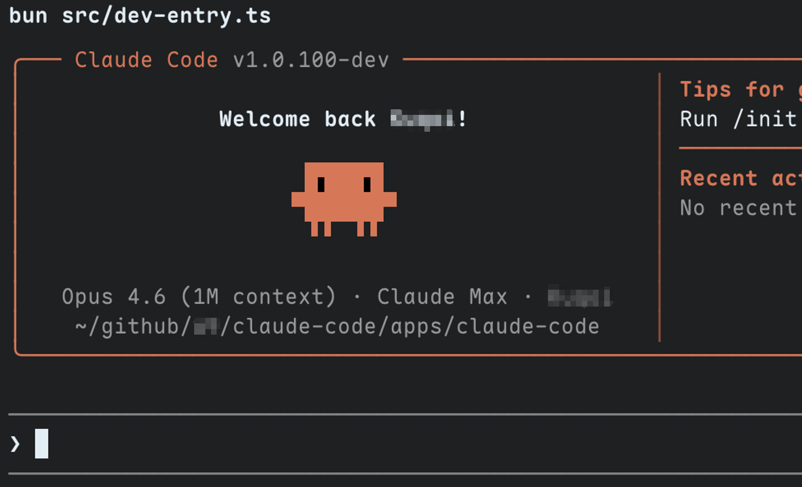
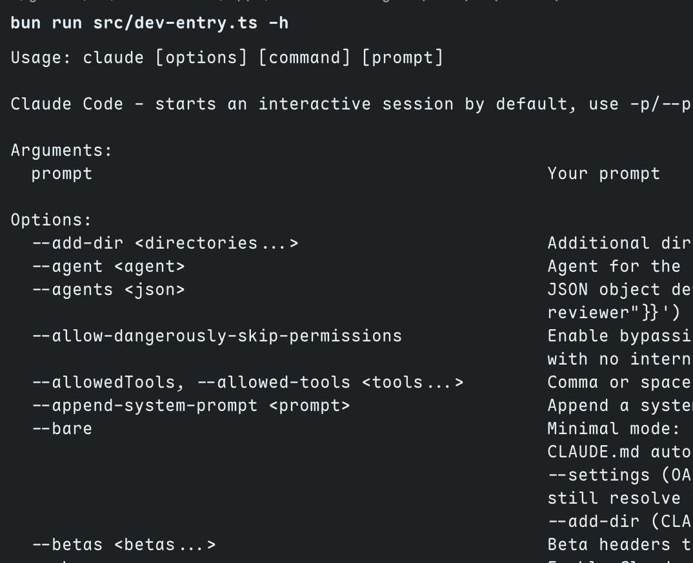

# Claude Code (Source)

Source code of the Claude Code CLI, extracted from the published package with missing type definitions restored and restructured as a Bun monorepo.



## Project Structure

```
apps/
  claude-code/              # Main application
packages/
  claude-for-chrome-mcp/    # @ant/claude-for-chrome-mcp mock package
  color-diff-napi/          # color-diff-napi workspace package
```

## Prerequisites

- [Bun](https://bun.sh/) >= 1.1

## Install

```bash
bun install
```

## Usage

```bash
# Start interactive REPL
cd apps/claude-code
bun src/dev-entry.ts

# One-shot prompt (non-interactive)
bun src/dev-entry.ts -p "your prompt"
```

Requires `ANTHROPIC_API_KEY` environment variable, or a prior login via the `claude` CLI.




## Development

`dev-entry.ts` is the development entry point. It polyfills compile-time macros (`MACRO`, `feature()`) injected by Bun's bundler, allowing the source to run directly without bundling.

```bash
# Start dev mode
cd apps/claude-code
bun run start

# Quick test
bun run hello
```

### Linting & Type Checking

```bash
# Fast lint with oxlint
bunx oxlint apps/claude-code/src/

# TypeScript type check (many known errors, for reference only)
bunx tsc --noEmit -p apps/claude-code/tsconfig.json
```

### Restored Files

See [CHANGES.md](./CHANGES.md) for a full manifest of files added or modified relative to the original published package.
